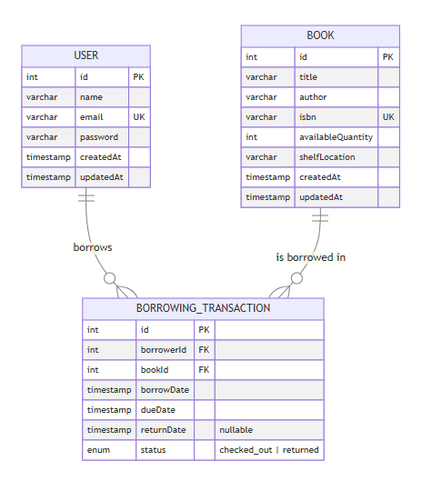

# Library Management System

A RESTful API for managing books, borrowers, and borrowing transactions. Built with NestJS, TypeORM, and PostgreSQL.

## Tech Stack

- **Runtime:** Node.js 18+
- **Framework:** NestJS 11
- **Database:** PostgreSQL 16
- **ORM:** TypeORM
- **Auth:** JWT (Bearer token)
- **Docs:** Swagger (OpenAPI)
- **Containerization:** Docker & Docker Compose

## Setup

### Option 1: Docker Compose (Recommended)

```bash
docker-compose up --build
```

The API will be available at `http://localhost:3000` and Swagger docs at `http://localhost:3000/api-docs`.

### Option 2: Local Development

1. **Prerequisites:** Node.js 18+, PostgreSQL running locally.

2. **Install dependencies:**
```bash
npm install
```

3. **Configure environment:** Copy `.env.example` to `.env` and update values:
```bash
cp .env.example .env
```

4. **Run the app:**
```bash
npm run start:dev
```

## API Endpoints

### Auth
| Method | Endpoint | Description |
|--------|----------|-------------|
| POST | `/auth/signup` | Register a new borrower |
| POST | `/auth/login` | Login with email & password |
| GET | `/auth/profile` | Get current user profile |

### Books
| Method | Endpoint | Description |
|--------|----------|-------------|
| POST | `/books` | Add a new book |
| GET | `/books` | List all books (search & pagination) |
| GET | `/books/:id` | Get book by ID |
| PUT | `/books/:id` | Update a book |
| DELETE | `/books/:id` | Delete a book |

### Borrowers
| Method | Endpoint | Description |
|--------|----------|-------------|
| GET | `/borrowers` | List all borrowers |
| GET | `/borrowers/:id` | Get borrower by ID |
| PUT | `/borrowers/profile` | Update own profile |
| DELETE | `/borrowers/profile` | Delete own profile |

### Borrowing Transactions
| Method | Endpoint | Description |
|--------|----------|-------------|
| POST | `/borrowings` | Check out a book (rate-limited) |
| POST | `/borrowings/return/:id` | Return a book (rate-limited) |
| GET | `/borrowings/my` | List all my borrowings |
| GET | `/borrowings/my/current` | List currently checked-out books |
| GET | `/borrowings/overdue` | List all overdue transactions |

### Reports
| Method | Endpoint | Description |
|--------|----------|-------------|
| GET | `/reports/summary` | Download borrowing summary as CSV |
| GET | `/reports/overdue-last-month` | Download overdue borrows from last month as CSV |
| GET | `/reports/borrowings-last-month` | Download all borrowings from last month as CSV |

## Running Tests

```bash
npm run test
```

## API Documentation

Interactive Swagger UI is available at `/api-docs` when the server is running.

## Database Schema


## Project Structure

```
src/
  auth/           # Authentication (signup, login, JWT)
  book/           # Book CRUD operations
  user/           # Borrower management
  borrowing-transaction/  # Checkout, return, overdue tracking
  common/         # Shared DTOs, enums, utilities
  guards/         # Auth guard
  middlewares/     # JWT middleware
  interceptors/   # Response & serialize interceptors
  filters/        # Global exception filter
  report/         # Analytical reports & CSV export
```
